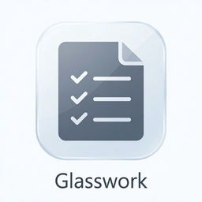
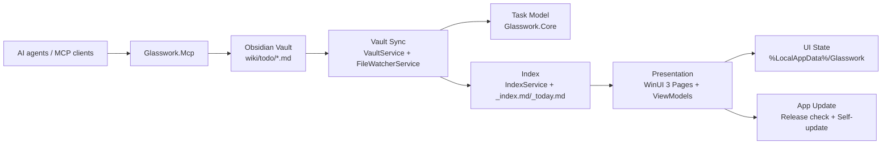

# Glasswork

**A Windows-native task manager that turns Azure DevOps work into Obsidian-backed Markdown tasks — readable by you, your vault, and your AI agents.**

[Why Glasswork](#what-makes-glasswork-different) · [Agent contract](#agent-friendly-by-design) · [Architecture](#architecture) · [Getting started](#getting-started)

[](https://github.com/tjegbejimba/Glasswork/actions/workflows/release.yml)
[](https://github.com/tjegbejimba/Glasswork/releases/latest)


<!--
README screenshot slots, once real app captures are available:

Recommended captures before sharing externally:

- My Day: active task cards, today's subtasks, and footer status bar.
- Task Detail: Description, Notes, Links, Backlinks, and Artifacts.
- Backlog board or Work Log, depending on the story you want to tell.

Suggested filenames: docs/images/readme/my-day-light.png and my-day-dark.png.
Insert them after the badges using a <picture> block with descriptive alt text.
-->

Glasswork bridges the gap between engineering work tracking and personal task ownership. Azure DevOps work items become contextual **Tasks**, broken into actionable **Subtasks**, stored as plain Markdown with YAML frontmatter in an Obsidian **Vault**.

The app is intentionally single-user and agentic by design: the Vault remains the source of truth, while the WinUI 3 app, MCP server, Obsidian, and coding agents all work against the same durable task model.

## What makes Glasswork different

- **Obsidian-native storage** — Tasks are `.md` files in the Vault, so they can be searched, edited, linked, backed up, and versioned outside the app.
- **My Day as a planning surface** — direct pins, due dates, flagged Subtasks, and virtual promotion decide what is **in My Day today** without polluting the task file.
- **ADO-to-personal-work bridge** — Azure DevOps Links and imports keep upstream work visible while letting the user decompose it into personal execution steps.
- **Agent-readable task state** — `_index.md`, `_today.md`, and the MCP server expose structured task context without requiring agents to scrape the UI.
- **Rich task context** — Description, Notes, Links, Backlinks, and read-only Artifacts keep implementation plans, investigations, PRs, and wiki references next to the work.

## Product surfaces

| Page | What it does |
| --- | --- |
| **My Day** | Default landing page for tasks in focus today, including virtually promoted parent tasks and today's subtasks. |
| **Backlog** | Active work not currently in My Day, with board-style organization by status. |
| **Task Detail** | Full task context: Description, Subtasks, Notes, Links, Backlinks, and agent-produced Artifacts. |
| **Work Log** | Completed work history for weekly review and connects-season reporting. |
| **Settings** | Vault selection, update checks, feedback, and app configuration. |

## Agent-friendly by design

> [!NOTE]
> Glasswork treats agents as first-class collaborators. Agents can read task context, add Artifacts, search prior work, and plan My Day without rewriting arbitrary task files directly.

The companion [`glasswork-mcp`](src/Glasswork.Mcp/README.md) server exposes typed tools over stdio:

| Tool | Purpose |
| --- | --- |
| `list_tasks` | Enumerate task summaries by status, parent, or projected fields. |
| `get_task` / `load_context` | Fetch full task context, including recursive subtasks and related context. |
| `search_tasks` | Discover tasks by topic across titles, Description, Notes, Subtasks, and tags. |
| `add_task` | Create a new Markdown-backed Task. |
| `add_artifact` | Attach an agent-produced Markdown work-product to a Task. |
| `set_my_day` | Direct-pin an existing Task into My Day for a date. |

Artifacts follow a documented write protocol so the app never renders half-written files. See [`docs/agent-contract.md`](docs/agent-contract.md).

## Architecture



The domain model is documented in [`CONTEXT.md`](CONTEXT.md), canonical terms live in [`UBIQUITOUS_LANGUAGE.md`](UBIQUITOUS_LANGUAGE.md), and durable design decisions are tracked in [`docs/adr/`](docs/adr/).

## Feature status

| Capability | App | MCP |
| --- | :---: | :---: |
| Obsidian Vault task storage | Yes | Yes |
| My Day planning | Yes | `set_my_day` |
| Backlog board | Yes | Read via `list_tasks` |
| Task search | UI navigation | `search_tasks` |
| Task detail context | Yes | `get_task` / `load_context` |
| Agent Artifacts | Read-only surface | `add_artifact` |
| Links and Backlinks | Yes | Included in context |
| Work Log | Yes | Planned |
| App self-update | Yes | N/A |

## Getting started

### Requirements

- Windows 11. `Glasswork.App` is a WinUI 3 desktop app targeting `net10.0-windows10.0.26100.0`.
- [.NET 10 SDK](https://dotnet.microsoft.com/download).
- An Obsidian Vault. Glasswork task files live under `wiki/todo/` inside the Vault.
- Optional: Azure DevOps access for ADO import and Links.

### Build from source

```powershell
dotnet restore
dotnet build src\Glasswork.App\Glasswork.csproj -c Debug -p:Platform=x64
dotnet run --project src\Glasswork.App\Glasswork.csproj --property:Platform=x64
```

`Glasswork.Core` and `Glasswork.Mcp` are cross-platform .NET 10 projects. The WinUI app itself must be built and run on Windows.

### Run tests

```powershell
dotnet test tests\Glasswork.Tests\Glasswork.Tests.csproj
```

## Releases

Glasswork ships two independently versioned components:

- **Glasswork.App** — WinUI 3 desktop app. Latest documented release: [`v1.4.1`](docs/releases/v1.4.1.md).
- **Glasswork.Mcp** — MCP server packaged as the `glasswork-mcp` .NET tool. Current package version: `0.6.0`.

Release notes live in [`docs/releases/`](docs/releases/) and the project changelog lives in [`CHANGELOG.md`](CHANGELOG.md).

## Why I built this

Azure DevOps is good at team-level work tracking, but it is not a personal execution system. Obsidian is great at long-lived knowledge, but it is not a structured task UI. Glasswork sits between them: a daily-driver Windows app that keeps work items, personal notes, task decomposition, wiki context, and agent-produced artifacts in one plain-text Vault.

## Development notes

- `Glasswork.Core` contains the pure task model, Vault parsing, indexing, search, and update/version logic.
- `Glasswork.App` contains the WinUI 3 Pages, controls, and service-locator wiring.
- `Glasswork.Mcp` exposes the Vault through a typed Model Context Protocol server for agents.
- Any code that writes the Vault must register with `SelfWriteCoordinator` so file-watcher events do not echo the app's own writes.

## Contributing and feedback

This is a personal project built for private daily use, but issues, questions, and design feedback are welcome. Start with the architecture docs before proposing changes: [`CONTEXT.md`](CONTEXT.md), [`UBIQUITOUS_LANGUAGE.md`](UBIQUITOUS_LANGUAGE.md), and [`docs/adr/`](docs/adr/).

## Security and privacy

Glasswork stores task data in the user's local Obsidian Vault. The app checks GitHub releases for updates and can link to Azure DevOps work items, but Vault contents are not uploaded to a Glasswork service.

## License

All rights reserved. This repository is source-visible as a portfolio and evaluation artifact; it is not licensed for redistribution or use in other products.